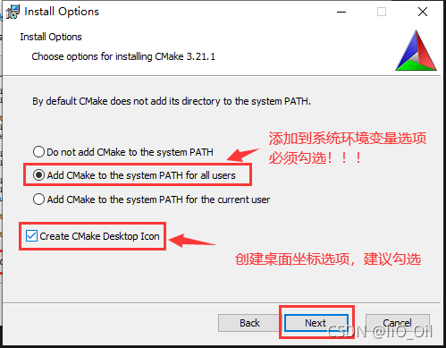
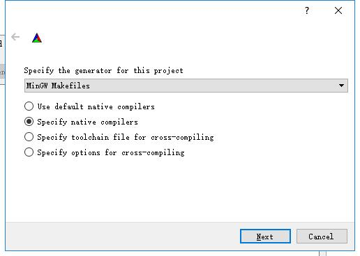
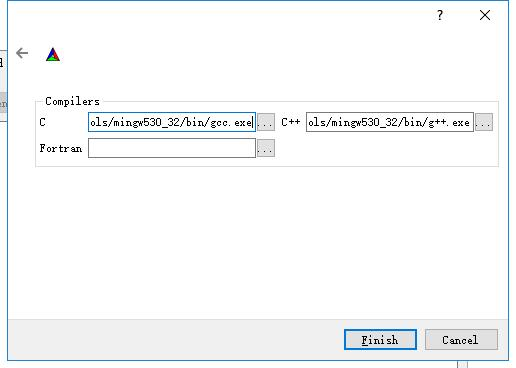
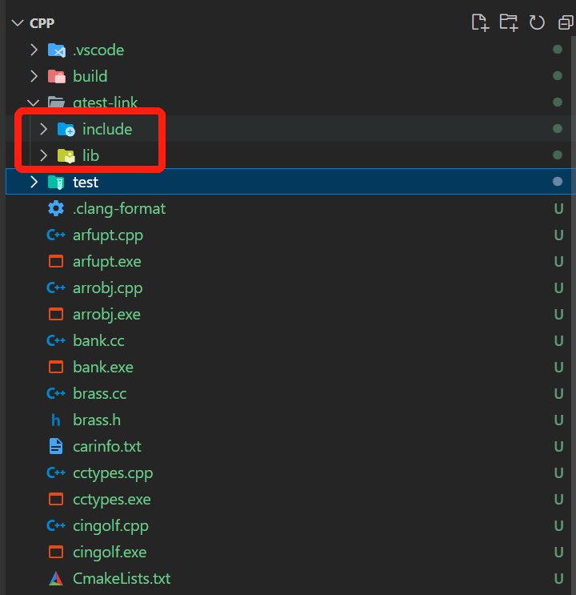
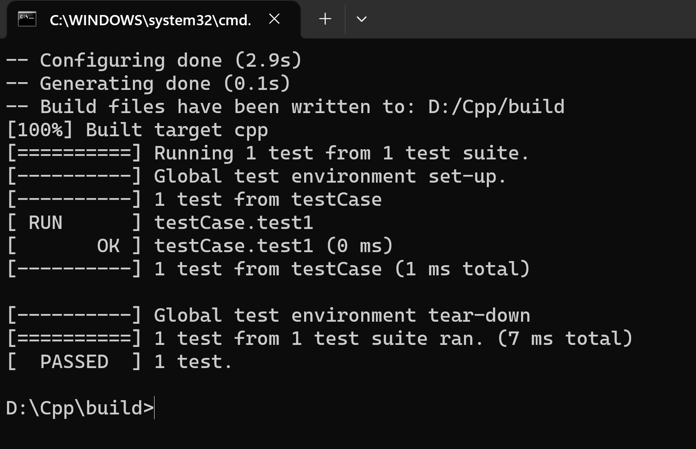

## Windows安装Google Test

参考地址：[https://blog.csdn.net/weixin_43158544/article/details/128592959](https://blog.csdn.net/weixin_43158544/article/details/128592959)

### vs code安装

  直接在官网安装，略过。

### g++ 安装

   安装最新的[MinGW-W64](https://sourceforge.net/projects/mingw-w64/files/Toolchains%20targetting%20Win64/Personal%20Builds/mingw-builds/)就行(我使用的是"**w64devkit-1.18.0.zip**"),将解压路径下的**bin**/文件夹加入系统环境变量中。

### cmake 安装
  
  cmake[下载地址](https://cmake.org/download/)
  下载可执行文件版本，一路next,选择如下选项，将cmake加入系统环境变量中：
  
  安装完成后，使用 `cmake --version`命令查看cmake安装完成。

### GoogleTest(gtest) 安装

  1. 下载最新版本的[gtest](https://github.com/google/googletest/releases),解压缩后进入压缩后的目录，创建一个**build**文件夹，使用cmake-ui进行预编译

     打开cmake-ui,进行如下配置：
     ,
     第二步configure如下：
     

     C语言选择GCC,C++语言选择G++:
     

  2. 完成cmake-ui预编译后，进入刚刚建好的**build**文件夹中，执行命令：`mingw32-make`
     命令会在**build**文件夹下生成**lib**文件夹，包含4个二进制文件（**libgtest.a**和**libtest_main.a**），将**lib**文件夹和googletest目录下的**include**文件夹拷贝到你的代码文件夹中：
       

  3. 在代码文件夹中新建CmakeLists.txt，内容如下：

   ```cmake
     #设置cmake最小版本，要比本地的版本低。固定写法
     cmake_minimum_required(VERSION 3.5)
     
     #建一个project，取名叫cpp
     project(cpp)
     
     #设置cmake时要include的文件路径
     include_directories(
      ${CMAKE_CURRENT_SOURCE_DIR}/gtest-link/include
     )
      
      #指定要链接的文件目录(这里并未执行链接)。因为lib下的.a文件都make过了，所以只需要链接一下即可。
      link_directories(
            ${CMAKE_CURRENT_SOURCE_DIR}/gtest-link/lib
      )
      
      #设置要编译的文件的名称，即test文件夹下面所有的.cpp文件都需要编译，他们整体取了个名字叫src_files
      file(GLOB_RECURSE src_files
          ${CMAKE_CURRENT_SOURCE_DIR}/test/*.cc
      )
      
      #将上述的src_files添加到可执行文件里，生产的可执行文件叫${PROJECT_NAME}。固定写法
      add_executable(${PROJECT_NAME} ${src_files})
      
      #告诉gcc去gtest这个目录(即link_directories)寻找lib库。(gtest这个名字是gcc取的)
      target_link_libraries(${PROJECT_NAME} gtest)
   ```

  4. 编写测试用例hellotest.cc:

    ```C++
     #include "gtest/gtest.h"
     
     int add(int a, int b) { return a * b; }
     
     // test case
     TEST(testCase, test1) {
          EXPECT_EQ(add(2, 8), 16);
          EXPECT_EQ(add(2, 6), 12);
     }
     
     int main(int argc, char** argv) {
          testing::InitGoogleTest(&argc, argv);
          return RUN_ALL_TESTS();
      }
    ```

  5. 根据以下命令，执行测试用例

   ```shell
     cmake -G "MinGW Makefiles" ..
     mingw32-make.exe
     .\cpp.exe
   ```

  其中，**cpp.exe**是根据**CmakeLists.txt**的project名称生成。将这3条命令集成到**test.bat**中：

  ```bat
    start cmd /k "cd build && cmake -G "MinGW Makefiles" .. && mingw32-make.exe && .\cpp.exe"
  ```

  测试结果如下：
  
